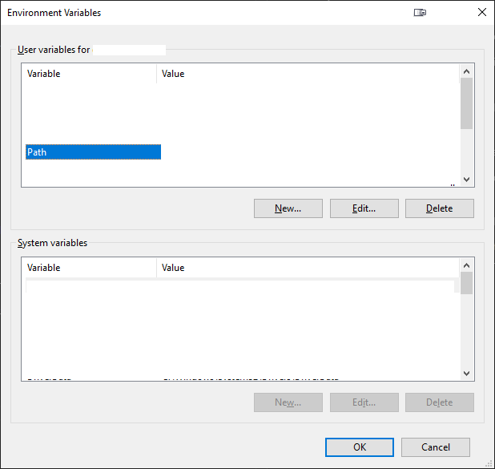
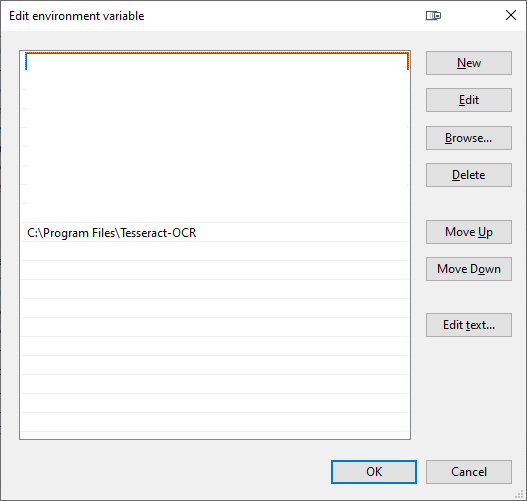

# How to add a new path to the PATH environment variable

First make sure you have the correct path ready to be copy-pasted.

1. Open the environment variable edit window. There are two options to do so:
   1. Search in start menu for `edit the system environment variables`, open the search result, look at the bottom and 
      click on the "Environment variables" button.
   2. Or open the run window by pressing `win + r` or right-click on the start menu and click on `run` then copy-paste 
      the following command `rundll32.exe sysdm.cpl,EditEnvironmentVariables` and press enter. 
2. Look for the `Path` variable in the top list.

3. Select the `Path` variable and click on `Edit`. This will open a new window with a list of entries.

4. Click on `New` and it should open an edit field at the end of the list. Paste the path in the selected line.
5. Click on `OK` on both windows.
6. You will need to restart any applications that need the new path. To make sure you can reboot your entire PC.